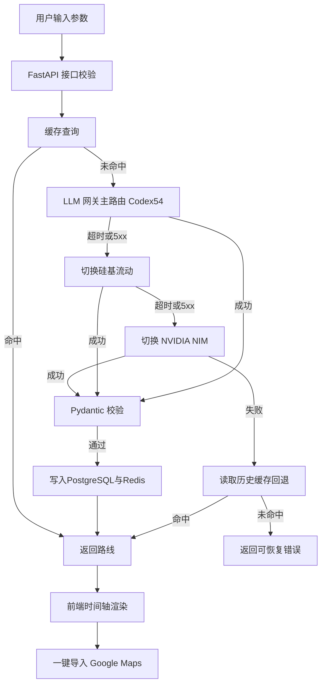

# HackTravel 实施蓝图 v2

## 1. 目标与边界

- 首发按档位 B 规划：
  - 匿名优先可用
  - 登录入口保留但默认关闭，可灰度开启
  - 三个 Tab：极限爆改、抄作业、盯盘
  - 路线生成、时间轴展示、一键导入 Google Maps、社区浏览、分享海报
- 同时保留降级档位 A 开关：
  - 关闭登录相关 UI 和后端鉴权依赖后可直接运行

## 2. 跨端总体架构

### 2.1 前端

- Expo + React Native + Expo Router
- UI：Tamagui 或 NativeBase 二选一（优先 Tamagui，跨端 Web/Native 支持最佳）
- 路由：Expo Router（基于文件系统，类 Next.js 约定式路由）
- 构建产物：
  - Web（PWA）：`npx expo export:web` → 静态文件部署 Vercel，用于社交裂变与早期验证
  - Android：`eas build --platform android` → 生成 `.aab` 提交 Google Play
  - iOS：`eas build --platform ios` → 生成 `.ipa` 提交 App Store
- 原生渲染保证：所有 UI 均为 Native Views，非 WebView 套壳，规避商店 Minimum Functionality 拒审
- 功能开关：
  - ENABLE_AUTH=false 默认关闭
  - ENABLE_POSTER_SHARE=true
  - ENABLE_WATCHLIST_LEAD_CAPTURE=true

### 2.2 后端

- FastAPI 提供统一 BFF API
- 关键模块：
  - itinerary_service 生成与缓存
  - llm_gateway 多供应商路由与自动切换
  - community_service 社区路线读写
  - share_service 海报任务
  - geocoding_service 坐标补全（模型输出缺经纬度时调 Google Geocoding / Nominatim 回填）
- 严格模型校验：Pydantic 解析并二次归一化
- Token 成本控制：命中缓存直接返回，避免重复调用大模型，实现毫秒级响应

### 2.3 数据层

- PostgreSQL：主存储
- Redis：请求级缓存、热点路线缓存、幂等键
- 对外 CDN：Cloudflare

### 2.4 模型路由

- 主：Codex 5.4 通过 OpenAI 兼容网关
- 备 1：硅基流动
- 备 2：NVIDIA NIM
- 自动切换策略：
  - 触发条件：超时、5xx、网关连接异常
  - 切换顺序：主 -> 备1 -> 备2
  - 全失败则回退缓存路线

## 3. API 与数据契约

### 3.1 行程生成请求

POST /v1/itineraries/generate

请求体字段：
- origin: string
- destination: string
- total_hours: integer
- budget:
  - amount: number
  - currency: CNY | USD
- tags: string[]
- locale: zh-CN | en-US
- timezone: string
- app_version: string
- idempotency_key: string

### 3.2 行程生成响应

- itinerary_id: string
- title: string
- summary:
  - total_hours: integer
  - estimated_total_cost:
    - amount: number
    - currency: CNY | USD
- legs: array
  - index: integer
  - start_time_local: ISO datetime
  - end_time_local: ISO datetime
  - activity_type: flight | transit | food | attraction | rest | shopping
  - place:
    - name: string
    - latitude: number
    - longitude: number
    - address: string
  - transport:
    - mode: walk | bus | metro | taxi | flight
    - reference: string
  - estimated_cost:
    - amount: number
    - currency: CNY | USD
  - tips: string[]
- map:
  - google_maps_deeplink: string
  - waypoints_count: integer
- source:
  - llm_provider: codex54 | siliconflow | nvidia
  - model_name: string
  - cache_hit: boolean
- policy:
  - is_user_generated: true
  - can_share: true

### 3.3 错误码

- HKT_400_INVALID_INPUT
- HKT_409_DUPLICATE_REQUEST
- HKT_422_SCHEMA_VALIDATION_FAILED
- HKT_429_RATE_LIMITED
- HKT_503_MODEL_UNAVAILABLE
- HKT_504_MODEL_TIMEOUT
- HKT_599_FALLBACK_CACHE_MISS

### 3.4 版本治理

- Header: X-Api-Version: 1
- 增量字段仅追加不破坏
- 废弃字段至少跨两个小版本

## 4. AI 生成链路设计

1) 输入规范化
- 文本裁剪、预算区间检查、时间单位统一

2) Prompt 组装
- 系统提示固定结构：角色设定（资深旅行规划师）+ 输出格式约束 + 示例 JSON 骨架
- 用户提示注入参数：出发地、目的地、总时长、预算、标签、时区
- 强制输出 JSON，不允许额外文本
- Prompt 要求每个 leg 必须包含：地点名称、精确起止时间、预估花费（人民币）、交通方式
- 输出锚定：使用 json 代码块 + stop sequence 截断，防止模型输出额外解释文本

3) 模型调用
- 超时阈值：主模型 15s，备用模型 20s
- 幂等键绑定
- 自动故障切换
- temperature 设为 0.3，保证路线输出稳定性

4) 结果校验
- Pydantic 一次校验
- 业务规则二次校验
- 地点坐标缺失时尝试地理编码补全

5) 回退策略
- 命中同条件缓存直接返回
- 全模型失败且无缓存时返回可恢复错误

## 5. Google Maps 一键导入

### 5.1 URL 方案

- 格式：`https://www.google.com/maps/dir/?api=1&origin=A&destination=B&waypoints=C|D|E&travelmode=transit`
- Google Maps URL waypoints 上限约 10 个，超限时自动分段生成多段链接
- 每个站点优先使用经纬度拼接（精度高），回退到地名编码

### 5.2 端差异处理

- Android：优先唤起 Google Maps
- iOS：优先 universal link，失败回浏览器
- Web：新标签页打开

### 5.3 回退机制

- 深链失败展示复制链接按钮
- 提供逐段导航入口

## 6. 前端信息架构与交互

### 6.1 Tab1 极限爆改

- 输入区：
  - 出发地 / 目的地（搜索自动完成）
  - 总时间（精确到小时，如 48 小时）
  - 人均预算（RMB / USD 一键切换）
  - 特种兵偏好标签：疯狂暴走 / 极限吃货 / 穷鬼免税店 / 打卡狂魔
- 结果区：
  - 顶部汇总大卡片：标题（如"48H 怒刷胡志明市，人均 ¥350 挑战"）、总耗时、总预计花费
  - 垂直时间轴，每节点示例：
    - 08:00 - 09:00：降落新山一机场，搭乘 109 路大巴（¥3）
    - 09:30 - 10:30：Phở Hòa Pasteur 吃粉（AI 预估 ¥15）
  - 悬浮大按钮 CTA："一键导入 Google Maps 🗺️"
- 默认内容：首屏展示 2-3 条热门预设路线（冲绳 48h / 胡志明市 72h / 曼谷 24h），确保审核人员和新用户进来就有内容可点
- 状态机：空态 → 加载骨架屏 → 成功渲染 → 失败态（重试按钮 + 幽默文案）

### 6.2 Tab2 抄作业

- 瀑布流卡片：封面图、标题、预算标签、总时长、热度（被抄次数）
- 详情页：完整时间轴 + 导图按钮 + 底部"我也要抄"快捷生成
- 社交分享：
  - 点击右上角生成高清海报图（含产品 Logo + 二维码 + 时间轴缩略）
  - 用户长按保存直接发小红书 / 微信朋友圈
  - 海报底部附 Web 版短链，实现裂变闭环

### 6.3 Tab3 盯盘

- 酷炫雷达扫描动画（CSS/Lottie）
- 文案："全球廉航（亚航 / 越捷 / 酷航）底价监控系统及超长中转拼接算法升级中…留下邮箱，上线送 1 个月高级会员"
- 邮箱收集表单（写入 lead_emails 表）
- 提供隐私说明与退订入口
- 目标：收集高意向种子用户线索，为 Google Play 20 人测试做储备

## 7. 社区库与分享链路

- 路线入库规则：
  - 达到质量分阈值
  - 去重哈希一致则计数加一
- 审核流：
  - 首发可人工白名单
  - 二期加自动内容审核
- 海报链路：
  - 前端触发生成任务
  - 后端渲染模板并返回图片 URL

## 8. 后端服务与数据模型

### 8.1 核心表

- users
- itineraries
- itinerary_legs
- itinerary_cache
- community_posts
- share_assets
- lead_emails
- api_request_logs

### 8.2 索引建议

- itineraries: destination + total_hours + budget_range
- itinerary_cache: query_hash unique
- community_posts: score desc + created_at desc
- api_request_logs: request_id + created_at

### 8.3 读写路径

- 先查缓存
- 缓存 miss 调模型
- 校验通过写入 itinerary 与 cache
- 社区精选异步入库

## 9. 部署与环境分层

### 9.1 环境

- local：本地开发
- staging：联调与商店演示
- production：正式环境

### 9.2 部署

- 前端 Web：`npx expo export:web` 产出静态文件 → 推送 Vercel
- 前端 Native：通过 EAS Build 云端构建
  - Android：`eas build --platform android --profile production` → `.aab`
  - iOS：`eas build --platform ios --profile production` → `.ipa`
  - 提交：`eas submit` 直推 Google Play / App Store Connect
- 后端与任务服务 Docker 化部署到 VPS
- Cloudflare 反向代理：
  - 开启 Full (Strict) SSL
  - 确认 VPS 开启 IPv6 监听，防止 Cloudflare 521 错误
  - Edge Cache TTL 配合 Redis 缓存策略

### 9.3 配置分离

- 供应商密钥按环境隔离
- Feature Flags 按环境控制
- 灰度发布以百分比放量

## 10. 应用商店合规清单

- 禁止纯 WebView 形态：Expo 渲染的均为 Native Views，合规
- 首屏必须有可交互内容与预设路线，审核人员一进来就有东西点
- 隐私政策与用户协议中英双语可访问（挂官网或 Notion 页面，App 内链接跳转）
- 权限最小化申请，先不申请通讯录等敏感权限
- 准备审核演示账号与演示脚本
- **Google Play 硬性要求**：封测期需 ≥20 名测试人员连续测试 ≥14 天
  - 策略：Web 版投放到特种兵旅游群招募种子用户，同步完成 Play 测试人数要求
- App Store 注意：若含动态内容生成需在审核备注说明 AI 使用场景
- 版本号规范：遵循 semver，每次提审递增 buildNumber

## 11. 质量保障

- 观测：
  - 接口成功率
  - 生成时延分位数
  - 模型切换次数
  - 缓存命中率
- 日志：request_id 全链路贯通
- 告警：超时、5xx、缓存穿透异常
- 回滚：
  - 模型路由回退到单供应商
  - 功能开关快速关闭登录与分享

## 12. 上线与增长闭环

- 冷启动内容：
  - 预置精品 Benchmark 路线，用真实需求给大模型做测试：
    - 槟城出发 → 新加坡长中转 → 冲绳，3000 元以内
    - 48H 怒刷胡志明市，人均 ¥350
    - 曼谷 24H 极限吃货路线，¥200 封顶
  - 精选 3-5 条路线作为 App 初始内容，确保首屏不空
- 种子用户：
  - Web 版投放特种兵旅游群（微信群 / Telegram / 小红书话题）
  - 生成"极限转机"神级路线图发小红书测试自然流量
  - 同步完成 Google Play 20 人封测要求
- 收集反馈：埋点 + 问卷 + 社区行为 + 路线评分
- 迭代策略：优先提升路线稳定性与导图成功率

## 13. 里程碑清单

### 13.1 天级执行排期

- **Day 1-3：跑通 AI 后端**
  - 调通大模型 API，死磕 Prompt 确保输出标准 JSON（含地点名称、时间、预算、坐标）
  - 实现 Pydantic 严格校验 + 业务规则二次校验
  - 测试 Google Maps URL 拼接功能
  - 完成 Redis 缓存层 + 幂等性保护
- **Day 4-10：前端 UI 构建**
  - Expo 项目初始化 + Expo Router + Tamagui 集成
  - 搭建三个 Tab 骨架 + 底部导航
  - Tab1：输入表单 → 调 API → JSON 渲染为垂直时间轴
  - Tab2：瀑布流列表 + 详情页
  - Tab3：雷达动画 + 邮箱收集
  - 预设路线数据填充，确保首屏有内容
- **Day 11-14：Web 端上线与裂变**
  - `npx expo export:web` → 部署 Vercel
  - 生成 3-5 条精品路线海报图
  - 投放社交媒体（小红书 / 微信群）测试自然流量
  - 开始收集种子用户邮箱
- **Day 15+：打包上架**
  - `eas build` 构建 Android `.aab` + iOS `.ipa`
  - 准备合规材料、审核演示脚本
  - 提交 Google Play 封测（需 20 人测试 14 天）
  - 根据反馈微调路线质量与导图成功率

### 13.2 里程碑总览

- M1 后端最小链路（Day 1-3）
  - 生成接口 + Pydantic 校验 + 缓存回退 + Google Maps URL
- M2 前端三 Tab 可用（Day 4-10）
  - 输入生成 + 时间轴渲染 + 导图 + 预设内容
- M3 Web 上线与裂变（Day 11-14）
  - Vercel 部署 + 海报生成 + 社交投放
- M4 上架准备（Day 15+）
  - 合规材料 + 打包提审 + 封测运营

## 14. 执行流程图



## 15. 默认功能开关矩阵

- ENABLE_AUTH=false
- ENABLE_COMMUNITY=true
- ENABLE_SHARE_POSTER=true
- ENABLE_WATCHLIST_LEAD_CAPTURE=true
- ENABLE_ADMIN_REVIEW=false

该蓝图已按你确认的策略固化：匿名优先、主模型 Codex 5.4、多供应商自动容灾、失败回缓存。

## 16. Token 成本优化策略

- 缓存命中 = 零 Token 消耗：
  - 同目的地 + 相近时长 + 相近预算的请求归一化为同一 query_hash
  - 缓存有效期按目的地热度分级：热门 7 天，冷门 3 天
- Prompt 精简：
  - 系统提示压缩至 500 token 以内
  - 用户提示仅注入必要参数，不做多余描述
  - 输出 JSON 字段精简，避免冗余嵌套
- 批量预热：
  - 冷启动期主动为热门目的地生成路线入库
  - 社区高热路线标记为永久缓存
- 监控：
  - 日均 Token 消耗量
  - 缓存命中率（目标 > 60%）
  - 单次生成平均 Token 数

## 17. 性能预算与离线降级

### 17.1 性能预算

- Web 端 FCP（First Contentful Paint）：< 1.5s
- Web 端 TTI（Time to Interactive）：< 3s
- 路线生成 API P95 响应：< 8s（含模型调用）
- 缓存命中路线 API P95 响应：< 200ms
- 前端 JS Bundle 体积：< 500KB gzip

### 17.2 离线与弱网降级

- 已浏览过的路线本地缓存（AsyncStorage / MMKV）
- 弱网状态下优先显示本地缓存路线 + 顶部提示横幅
- 路线生成请求超时后显示"网络不给力"+ 重试，而非白屏
- Google Maps 导入为 URL 跳转，不依赖本地网络状态
- Tab2 抄作业列表支持分页预加载，减少滚动加载等待

## 18. 埋点事件清单

### 18.1 核心事件

| 事件名 | 触发时机 | 关键参数 |
|--------|---------|---------|
| page_view | 切换 Tab / 进入详情 | tab_name, screen_name |
| generate_start | 点击生成按钮 | destination, hours, budget |
| generate_success | 路线返回成功 | itinerary_id, cache_hit, latency_ms |
| generate_fail | 路线返回失败 | error_code, provider |
| map_export_click | 点击导入 Google Maps | itinerary_id, waypoints_count |
| map_export_success | 成功唤起地图 | platform |
| share_poster_click | 点击生成海报 | itinerary_id |
| share_poster_save | 海报保存到相册 | itinerary_id |
| community_view | 浏览社区路线 | post_id |
| community_copy | 点击"我也要抄" | post_id |
| lead_email_submit | 盯盘 Tab 提交邮箱 | - |

### 18.2 实现方案

- 前期用轻量方案：自建 `/v1/events` 接口 + 批量上报
- 后期可迁移至 Amplitude / Mixpanel
- 所有事件附带 anonymous_id（设备指纹）+ session_id + app_version

## 19. Prompt 工程深度设计

### 19.1 系统提示模板

```
你是一位经验丰富的特种兵旅行规划师。根据用户给出的出发地、目的地、时长和预算，规划一条极限省钱、时间紧凑的路线。

严格要求：
1. 输出格式为 JSON，不允许任何额外解释文本
2. 每个 leg 必须包含：地点名称、经纬度、起止时间（ISO 8601）、交通方式、预估花费
3. 花费必须标注币种，默认人民币
4. 时间必须连续，不允许出现未安排的空档
5. 总花费不得超过用户设定的预算上限
6. 优先推荐当地人去的平价餐厅和免费景点
```

### 19.2 输出 JSON 骨架

```json
{
  "title": "string",
  "summary": { "total_hours": 0, "estimated_total_cost": { "amount": 0, "currency": "CNY" } },
  "legs": [
    {
      "index": 0,
      "start_time_local": "ISO datetime",
      "end_time_local": "ISO datetime",
      "activity_type": "food|transit|attraction|rest|shopping|flight",
      "place": { "name": "", "latitude": 0, "longitude": 0, "address": "" },
      "transport": { "mode": "walk|bus|metro|taxi|flight", "reference": "" },
      "estimated_cost": { "amount": 0, "currency": "CNY" },
      "tips": [""]
    }
  ]
}
```

### 19.3 容错策略

- 模型输出非标准 JSON 时：尝试 json.loads → 正则提取 JSON 块 → 失败则重试一次
- 坐标缺失：调 geocoding_service 补全
- 预算超标：重新调用并在 Prompt 追加"预算已超标，请压缩"

## 20. EAS 构建与签名流程

### 20.1 项目配置

- 安装 EAS CLI：`npm install -g eas-cli`
- 登录：`eas login`
- 初始化：`eas build:configure`
- `eas.json` 配置 profiles：development / preview / production

### 20.2 Android 签名

- 首次构建 EAS 自动生成 Keystore（托管在 Expo 云端）
- 也可使用自有 Keystore：`eas credentials`
- 输出 `.aab` 文件，直接上传 Google Play Console

### 20.3 iOS 签名

- 需要 Apple Developer 账号（$99/年）
- EAS 自动管理证书与 Provisioning Profile
- 输出 `.ipa` 文件，通过 `eas submit` 推送至 App Store Connect

### 20.4 CI/CD 集成

- GitHub Actions 触发自动构建：
  - main 分支合并 → 自动触发 `eas build --platform all --profile production`
  - 构建成功后自动运行 `eas submit`
- 环境变量通过 EAS Secrets 管理，不入代码仓库

## 21. 安全与限流策略

### 21.1 API 限流

- 匿名用户：10 次/小时（按设备指纹）
- 已登录用户（灰度启用后）：50 次/小时
- 实现：Redis 滑动窗口计数器
- 超限返回 HKT_429_RATE_LIMITED + Retry-After header

### 21.2 输入安全

- 所有用户输入经过 XSS 过滤与长度截断
- Prompt 注入防护：用户输入作为独立变量注入，不拼接进系统提示
- 幂等键防重：同一 idempotency_key 10 分钟内返回缓存结果

### 21.3 数据安全

- 匿名用户数据按设备指纹关联，无 PII 收集
- lead_emails 表加密存储（AES-256）
- API 密钥不入代码仓库，通过环境变量 / EAS Secrets 注入
- PostgreSQL 连接强制 SSL